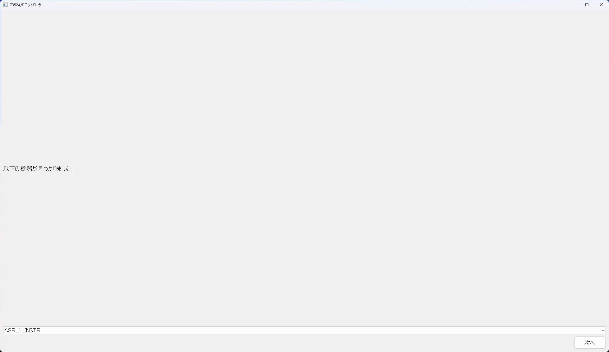
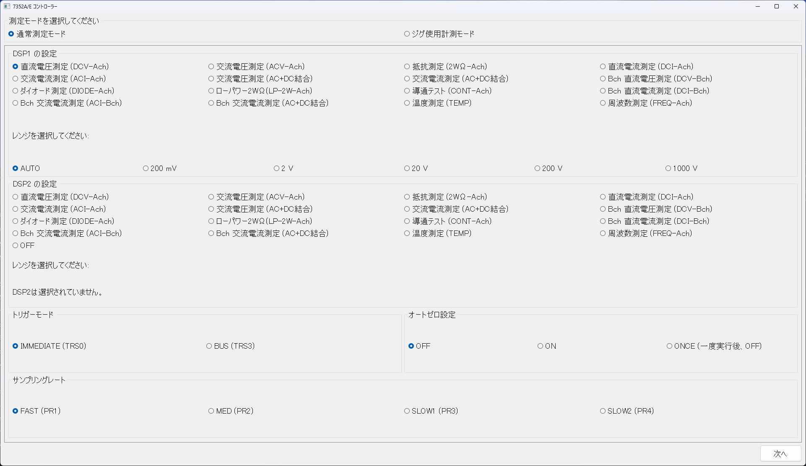
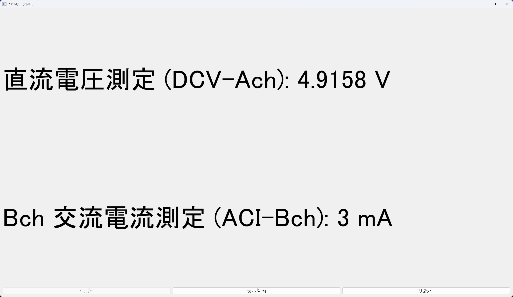
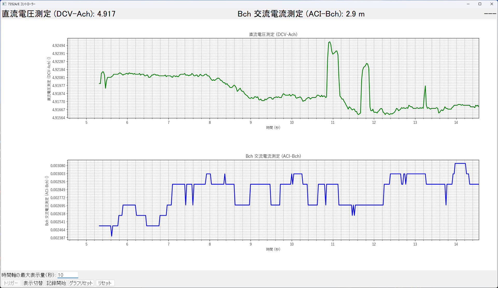

# 7352A/E コントローラー

7352A/E コントローラーは、PyQt5を使用して開発されたデジタルマルチメーター（DMM）制御アプリケーションです。

このアプリケーションは、さまざまな測定モードをサポートし、リアルタイムで測定値を表示およびグラフ化します。

[ADCMT社製の7352A/Eシリーズ](https://www.adcmt.com/products/dmm/7352) DMMを制御するために設計されているため、他のDMMには対応していません。

**制作者はADCMT社とは関係ありません。また、このアプリケーションはADCMT社の公式アプリケーションではありません。**

**さらに、このアプリケーションを使用して測定したデータの正確性について、制作者は一切保証しません。**

## 主な機能
- **デバイス選択**: 接続可能なDMMを自動検出し、ユーザーが選択できます。
- **測定モード設定**: 直流電圧、交流電圧、抵抗、電流、ダイオード測定など、豊富な測定オプションを提供します。
- **ジグ測定モード**: 特定のジグを使用した測定モードをサポートします。
- **リアルタイム値表示**: 測定結果を大きなフォントでリアルタイムに表示します。
- **グラフ表示**: 測定データを時間軸に沿ってグラフ化し、視覚的に解析可能です。
- **データ記録**: 測定データをCSV形式で保存できます。
- **トリガーモード**: 即時トリガーおよびバストリガーの切り替えが可能です。
- **オートゼロ設定**: 測定精度を向上させるためのオートゼロ機能を提供します。

## スクリーンショット


*デバイス選択画面の例*


*測定モード設定画面の例*


*値表示モードの例*


*グラフ表示モードの例*

## インストール方法

### 前提条件

- Python 3.6以上
- pip

### 必要なパッケージのインストール

以下のコマンドを使用して必要なパッケージをインストールできます。

```bash
pip install -r requirements.txt
```

### アプリケーションの実行

リポジトリをクローンし、以下のコマンドでアプリケーションを実行します。

```bash
python dmm_controller.py
```

## 使い方

1. **デバイス選択**:
   - アプリケーションを起動すると、接続可能なDMMのリストが表示されます。
   - 使用するDMMを選択し、「次へ」ボタンをクリックします。

2. **測定モード設定**:
   - 測定モード（通常測定モードまたはジグ使用計測モード）を選択します。
   - 必要に応じて、ジグ測定モードを選択します。
   - DSP1およびDSP2の測定項目とレンジを設定します。
   - トリガーモード、サンプリングレート、オートゼロ設定を行い、「次へ」ボタンをクリックします。

3. **モード選択**:
   - 値表示モードまたはグラフ表示モードを選択します。
   - 「リセット」ボタンでアプリケーションを初期状態に戻すことができます。

4. **値表示モード**:
   - リアルタイムで測定値が表示されます。
   - 「トリガー」ボタンでトリガー信号を送信できます。
   - 「表示切替」でモード選択画面に戻ります。
   - 「リセット」ボタンでアプリケーションをリセットします。

5. **グラフ表示モード**:
   - 測定データがリアルタイムでグラフ化されます。
   - 「トリガー」ボタンでトリガー信号を送信できます。
   - 「表示切替」でモード選択画面に戻ります。
   - 「記録開始」ボタンで測定データをCSV形式で保存できます。
   - 「グラフリセット」ボタンでグラフをリセットします。
   - 「リセット」ボタンでアプリケーションをリセットします。

## ジグ測定モードの詳細

ジグ測定モードは、特定の測定目的に応じて事前に設定された回路構成を使用します。以下に、各ジグモードとそれぞれが動作する回路の概要を説明します。

### 1. 四端子抵抗測定A_V

**説明**

四端子抵抗測定A_Vモードは、高精度な抵抗測定を目的としています。このモードの使用には別途DC電源が必要です。  
Bchで直流電流を計測するため、大電流での計測が可能です。

**動作概要**

- Achで直流電圧を計測  
- Bchで直流電流を測定し、電圧と電流の比率から抵抗値を計算します。

### 2. 四端子抵抗測定B_V

**説明**

四端子抵抗測定B_Vモードは、高精度な抵抗測定を目的としています。このモードの使用には別途DC電源が必要です。  
四端子抵抗測定A_Vモードとは異なり、Achで直流電流を計測し、Bchで直流電圧を測定するため、小電流での計測が可能です。

**動作概要**

- Achで直流電流を計測  
- Bchで直流電圧を測定し、電圧と電流の比率から抵抗値を計算します。

### 3. hFE測定

**説明**

hFE測定モードは、トランジスターの直流電流増幅率（hFE）を測定するために使用されます。

**動作概要**

- Achでベース電圧を計測  
- Bchでコレクタ電流を測定し、hFEを計算します。

### 4. 電力計測(小電流)

**説明**

小電流を使用した電力計測モードで、微小な電力の測定に適しています。

**動作概要**

- Achで直流電流を計測  
- Bchで直流電圧を測定し、電圧と電流の積から電力を計算します。

### 5. 電力計測(大電流)

**説明**

大電流を使用した電力計測モードで、高電力の測定に適しています。

**動作概要**

- Achで直流電圧を計測  
- Bchで直流電流を測定し、電圧と電流の積から電力を計算します。

## 依存関係

- [PyVISA](https://pyvisa.readthedocs.io/en/latest/)
- [PyQt5](https://www.riverbankcomputing.com/software/pyqt/intro)
- [Matplotlib](https://matplotlib.org/)

## 作者
- [kitour](https://github.com/kitour)
"# ADCMT-7352A-E-controller" 
"# ADCMT-7352A-E-controller" 
"# ADCMT-7352A-E-controller" 
"# ADCMT-7352A-E-controller" 
